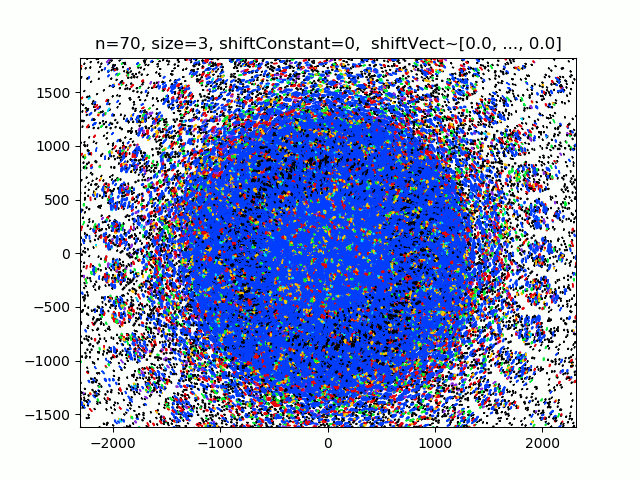

# PenroseAutomata
     A series of algorithms to automate the PT calculated in the PenroseTiler repository
The PenroseAutomata repository comprises fours parts:
- The main python scripts (MultigridTree, Multigrid, MultigridCell)
- The supplementary scripts (QuadTree)
- 2 folders used for caching data ('TrashTrees', 'MultigridTreeData')
- Misc. files (README.md, _pycache_)

# If Here For Pretty Pictures
If you are here for the prety pictures and gifs, please go towards the bottom and skip the cs/math

# Before Running
There are two important things to know before running these algorithms. Most importantly, make sure that two folders named 'TrashTrees' and 'MultigridTreeData' are both in the local directory (mind the caps). Second, if prompted to download Plotly, you must execute the commands as prompted on the console (if you use python you will thank me later for this).

# How To Run
To familiarize yourself with how these scripts work, run MultigridTree.py locally via main(). Notice that this will create a folder in 'TrashTrees' or 'MultigridTreeData'.
If the tiling automata survives to maxGen generations, it will be palced in 'MultigridTreeData', otherwise it will be placed in 'TrashTrees'.
The Dimmension of the tiling is given by dim, and the size is given by size. Notice the tiling has (dim choose 2)*size*size tiles.
sC of 0 makes a true penrose tiling, while 1/2 makes a generalized tiling.
shiftZeroes, shiftRandom, shiftByHalves should be tempered with at your discretion.
isRadByDim, isRadBySize set streaked and radial initial conditions for the tiling respectively.
numColors is the number of boundaries in the tiling, numStates is the number of total states. Notice that numStates >= numColors
gol is a boolean, setting it to True sets and updates tile values in binary as the game of life does, this can be specified in Multigrid.updateTileValsGOL()

Running these algorithms will generally involve creating MultigridTree objects with different parameters. Feel free to tweak the files to your whims, currently the constructor will generate a gif saved to one of the local sub-directories. Creating a QuadTree object specifically involves creating a 4 dimensional MultigridTree object and transferring its data back and forth between the grid and quadTree objects.

# Brief History
This repository exists in lieu of the PenroseTiler repository. The PenroseTiler repository itself comprises the scripts necessary to run a genetic algorithm used to find the set of valid functions that project from a mother lattice to an arbitrary tiling described be a series of objects. The tilings are evaluated using brute force to calculate the number of white (or untiled) pixels to evaluate the fitness of several functions.

The algorithm is successful in finding two trivial solutions, and one generalized solution. The two trivial solutions are capable of producing generalized crystalline tilings while the generalized solution is much more robust and can handle many more shift vector initial conditions.

This repository was initiated in order to provide a library of functions that act on the more robust of the functions.

# Examples
## Single Frame Tilings
You can think as each of these tilings as its own universe, that is an unfilled universe with no states.
Rather, each state here can be thought of as the type of tiling that comprises the space.
     Let's remember that:
     - if dim is odd: there are (dim-1)/2 types of tiles
     - if dim is even: there are (dim/2)-1 types of tiles
All tilings comprise unit lengths and the vertices are uniformly distributed across the tilings with increasing and decreasing densities, such that each density occurs with frequency of the golden ratio power series.

#### The following tilings are generated in high dimmensions with smaller and smaller sizes
###### dim=100 tiling
- <https://github.com/jcanedo279/PenroseAutomata/blob/master/Examples/n100.png>

###### dim=209 tiling
- <https://github.com/jcanedo279/PenroseAutomata/blob/master/Examples/n209Out.png>

###### dim=401 tiling
The following tiling contians over 2 million tiles
- <https://github.com/jcanedo279/PenroseAutomata/blob/master/Examples/n401Out.png>
- <https://github.com/jcanedo279/PenroseAutomata/blob/master/Examples/n401Mid.png>
- <https://github.com/jcanedo279/PenroseAutomata/blob/master/Examples/n401In.png>

###### dim=501 tiling
The following tiling contians over 1.2 million tiles
- <https://github.com/jcanedo279/PenroseAutomata/blob/master/Examples/n501Out.png>
- <https://github.com/jcanedo279/PenroseAutomata/blob/master/Examples/n501In.png>

## Cellular Automata
#### Convergent merging algorithms:
We can set any initial condition on any tiing (the more symmetric the easier) then apply state transitions for each tile relative to surrounding tile states.
This has the effect of averaging the values in an autonomistic fassion in that each automaton has innate variation in its transition rules that allows for emergent behaviour.

#### Redundantly mapped states from 7 dimmensions:
A redundantly mapping algorithm is one in which the bouding function that maps from the number of states to the number of boundaries is not one to one.
That is, that there are more states than boundaries (preferably by at least one order of magnitude).

#### Partially mapped states:
A partially mapping algorithm is one in which the bouding function is not only one to one, but also the transition from state to state is slow.

#### Deep potential wells as acheieved by certain even dimmensions:
In certain even dimmensions (8, 10, 12), deep potential wells form where the geometric/topological frustration of the vertices on the plane force
tiling patterns to become localized almost forming emmergent patterns/units. Here certain geometric properties of the tilings make it so that information
in these systems tend towards potential wells whose boundaries are defined by the emergent patterns.

#### Combining deep potential wells and redundant mapping:
In contrast to the more crystalline state evolution of deep potential well algorithms, redundantly mapped algorithms on potential wells form amorphous patterns
similar to those of redundant mapping algs but more crystalline.

#### Adaptive boundary:
Adaptive bundary algorithms are those in which the background or end of the tiling are updated via a function.
Here the function is the boundary color of the mean of board.

#### Game of life pattern that diverges:
In a gol algorithm in which a high neighbour count seeds an on state, we get a divergent system.
Here we are on if nCount is greater than 4 and smaller than 7

#### Sample oscillators from 10 dimmensions, even dimmensions create deeper state wells:
If we shift the acceptance bounds down by one we get a quickly convergent algorithm, where we are left with some sample 10d pt gol oscillators
Here we are on if nCount is greater than 3 and smaller than 6
