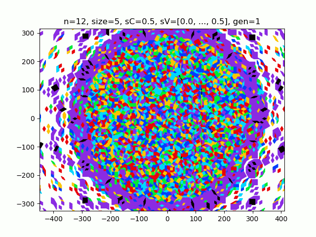

# PenroseAutomata
     A series of algorithms to automate the PT calculated in the PenroseTiler repository
The PenroseAutomata repository comprises five parts:
- The main python scripts (MultigridList, Multigrid, MultigridCell)
- The supplementary scripts (QuadTree)
- 2 folders used for caching data ('TrashLists'//non-selective, 'MultigridListData'//selective)
- 2 additional soft folders ('About The Method'//theMath, 'Examples'//prettyAnimations)
- Misc. files (README.md, '_pycache_', '.DS_Store')

# If Here For Pretty Pictures
If you are here for the prety pictures and gifs, please go towards the bottom and skip the cs/math

# How To Run
To familiarize yourself with how these scripts work, run MultigridList.py locally via its main() method. Notice that this will create a folder in 'TrashLists' or 'MultigridListData' containing a gif of a cellular autonoma and two graphs.
If the tiling automata survives to maxGen generations, the tiling folder will be palced in 'MultigridListData', otherwise it will be placed in 'TrashLists'.
Everytime you run the multigridList file, it will clear 'TrashLists' for you, therefore move the files you like to 'MultigridListData'

The Dimmension of the tiling is given by dim, and the size is given by size. Notice the tiling has (dim choose 2)*(2*size+1)^2 tiles.
sC of 0 makes a true penrose tiling, while 1/2 makes a generalized tiling.
Passing a value into shiftVect will initialize a tiling to a specific initial condition.
shiftZeroes, shiftRandom, shiftByHalves should be tempered with at your discretion.
isRadByDim, isRadBySize set streaked and radial initial conditions for the tiling respectively.
numColors is the number of boundaries in the tiling, numStates is the number of total states. Notice that numStates >= numColors
gol is a boolean, setting it to True sets and updates tile values in binary as the game of life does, this can be specified in Multigrid.updateTileValsGOL()

Running these algorithms will generally involve creating MultigridList objects with different parameters. Feel free to tweak the files to your whims, currently the constructor will generate a gif saved to one of the local sub-directories. Creating a QuadTree object specifically involves creating a 4 dimensional MultigridList object and transferring its data back and forth between the grid and quadTree objects.

# Brief History
This repository exists in lieu of the PenroseTiler repository. The PenroseTiler repository itself comprises the scripts necessary to run a genetic algorithm used to find the set of valid functions that project from a generalize mother lattice to an arbitrary unitary tiling described by a series of tile objects stored in the multigrid. The tilings are evaluated using brute force to calculate the number of white (or untiled) pixels to then evaluate the fitness of several functions in tiling a plane given a lattice.

Additionally, since the complexity of the calculation is so large, and the search complexity space so large O(g(dim, size, sC, sV, M)), where g(dim, size, sC, sV, M) is the
bounding function of the order dim^2*size^2*sC*M (this is definitely a gross underestimate). Strictly speaking, the search space of the one to one function that maps from a generalized mother lattice in dimmension dim, to a generalized unitary tiling in R2. In order to map the entire complexity space, we would need more computational power than exists in the universe. Thus we need to do two things. First, we create an algorithm that can save the fitnesses of tilings, so that if a genetic tiling process core dumps, the previous generation is saved to an IO file. This however is still not enough, so far we have only insured that any work can be saved and built upon and thus redundant calculations avoided (also ultimately fitter tiles). And because the search space is so large, nothing short of a NEAT algorithm will ensure that we get to the solution as quickly as possible. Thus we are left to some analytical caltulating to do, lets first solve the system trivially. The projective function E(K(p_rs_ab)) is trivial when the shiftVectors are all approximately zero, yet form a non-singular grid. By limiting the sVs to (10^-10 less than sV_i less than 10^-3), and by discretizing: the R2 projection grid space, the sC selection space, and the M selection space to a definition of 0.001. By further limiting (3 less than dim less than 100) and by discretizing the sC selection space we reduce the search space to a fixed approximately 10^14 possible projective functions that map our ludicrously small trivial search space.

After a few weeks of searching, the genetic algorithm was successful in finding two trivial solutions. One being that described the Laura Effinger, the other is a new method. Yet undiscovered: which tiles the grid where sC=0 by the function K(p_i)=round(E_i dotProd p_rs_ab + sV_i), oddly enough this produces a generalized tiling even though sC=0. Some other more technical details here are removed, such as additional parameters that are required for this new trivial solution.

Using the trivial solutions we put some good candidate functions in and found a general function that accomplishes our task. The two trivial solutions are capable of producing generalized crystalline tilings while the generalized solution is much more robust and can handle many more shift vector initial conditions. This repository was created in order to provide a library of functions that act on the more robust of the projective functions.

Some automata algorithms were rather difficult to create. Specifically the adaptive boundary algorithms that predicts and skips stable tiles as well as the adaptive boundary approximation which skips certain heavy (and honestly insignificant relative to the expense) calculations in order to predict approximately how a generalized automata distributes information over a system of tiles.

# Examples
### Single Frame Tilings
You can think as each of these tilings as its own universe, that is an unfilled universe with no states.
Rather, each state here can be thought of as the type of tiling that comprises the space.
     Let's remember that:
     - if dim is odd: there are (dim-1)/2 types of tiles
     - if dim is even: there are (dim/2)-1 types of tiles
All tilings comprise unit lengths and the vertices are uniformly distributed across the tilings with increasing and decreasing densities, such that each density occurs with frequency of the golden ratio power series.

     The following tilings are generated in high dimmensions with smaller and smaller sizes:
**dim=100 tiling**
- <https://github.com/jcanedo279/PenroseAutomata/blob/master/Examples/n100.png>

**dim=209 tiling**
- <https://github.com/jcanedo279/PenroseAutomata/blob/master/Examples/n209Out.png>

**dim=401 tiling**
The following tiling contians over 2 million tiles
- <https://github.com/jcanedo279/PenroseAutomata/blob/master/Examples/n401Out.png>
- <https://github.com/jcanedo279/PenroseAutomata/blob/master/Examples/n401Mid.png>
- <https://github.com/jcanedo279/PenroseAutomata/blob/master/Examples/n401In.png>
**dim=501 tiling**
The following tiling contians over 1.2 million tiles
- <https://github.com/jcanedo279/PenroseAutomata/blob/master/Examples/n501Out.png>
- <https://github.com/jcanedo279/PenroseAutomata/blob/master/Examples/n501In.png>

### Cellular Automata
**Convergent merging algorithms:**
We can set any initial condition on any tiing (the more symmetric the easier) then apply state transitions for each tile relative to surrounding tile states.
This has the effect of averaging the values in an autonomistic fassion in that each automaton has innate variation in its transition rules that allows for emergent behaviour.

**Redundantly mapped states from 7 dimmensions:**
A redundantly mapping algorithm is one in which the bouding function that maps from the number of states to the number of boundaries is not one to one.
That is, that there are more states than boundaries (preferably by at least one order of magnitude).

**Partially mapped states:**
A partially mapping algorithm is one in which the bouding function is not only one to one, but also the transition from state to state is slow.
Note that these algorithms also use adaptive boundaries as they are computationally heavy to recreate, additionally the four following tilings are made using a
method that approximates the boundaries (they are very heuristic and not so accurate), although they are accurate at predicting the final divergent or convergent
 dstate of the tiling.

The two following automata is made by using heavier calculation that is completely (or at least almost) accurate. Note that for accurate adaptive boundaries, there is some
fluctuation at the backgroud (which sets a potential reference to the tiling). Boundary approximations have no such fluctuation.

**Deep potential wells as acheieved by certain even dimmensions:**
In certain even dimmensions (8, 10, 12), deep potential wells form where the geometric/topological frustration of the vertices on the plane force
tiling patterns to become localized almost forming emmergent patterns/units. Here certain geometric properties of the tilings make it so that information
in these systems tend towards potential wells whose boundaries are defined by the emergent patterns.

**Combining deep potential wells and redundant mapping:**
In contrast to the more crystalline state evolution of deep potential well algorithms, redundantly mapped algorithms on potential wells form amorphous patterns
similar to those of redundant mapping algs but more crystalline.

**Adaptive boundary:**
Adaptive bundary algorithms are those in which the background or end of the tiling are updated via a function.
Here the function is the boundary color of the mean of board.

**Game of life pattern that diverges:**
In a gol algorithm in which a high neighbour count seeds an on state, we get a divergent system.
Here we are on if nCount is greater than 4 and smaller than 7

**Sample oscillators from 10 dimmensions, even dimmensions create deeper state wells:**
If we shift the acceptance bounds down by one we get a quickly convergent algorithm, where we are left with some sample 10d pt gol oscillators
Here we are on if nCount is greater than 3 and smaller than 6
