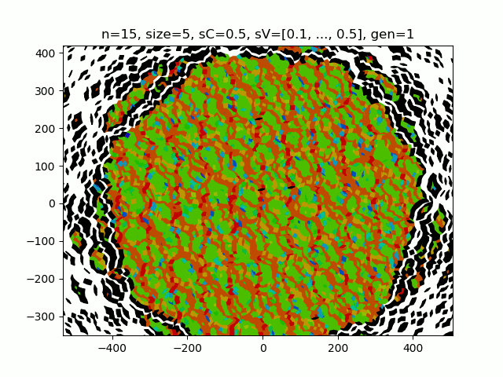
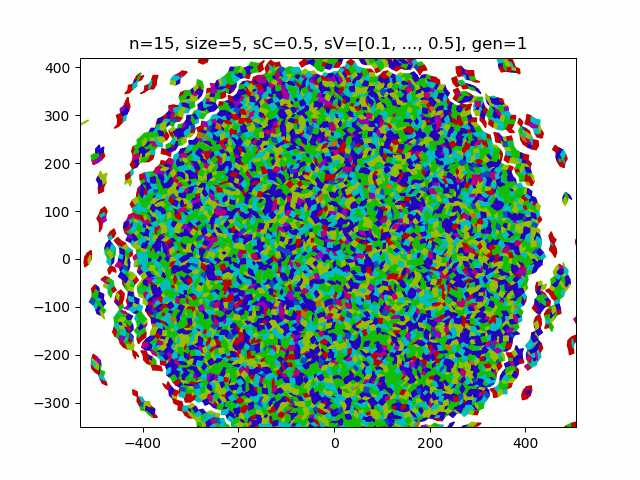

# PenroseAutomata
A series of algorithms to automate the PT calculated in the PenroseTiler repository

# Sample Results / Animations
### Single Frame Tilings
You can think as each of these tilings as its own universe, that is an unfilled universe with no states.
Rather, each state here can be thought of as the type of tiling that comprises the space.
     Let's remember that:
     - if dim is odd: there are (dim-1)/2 types of tiles
     - if dim is even: there are (dim/2)-1 types of tiles
All tilings comprise unit lengths and the vertices are uniformly distributed across the tilings with increasing and decreasing densities, such that each density occurs with frequency of the golden ratio power series.

     The following tilings are generated in high dimmensions with smaller and smaller sizes:
**dim=100 tiling**
- <https://github.com/jcanedo279/PenroseAutomata/blob/master/Examples/n100.png>

**dim=209 tiling**
- <https://github.com/jcanedo279/PenroseAutomata/blob/master/Examples/n209Out.png>

**dim=401 tiling**
The following tiling contians over 2 million tiles
- <https://github.com/jcanedo279/PenroseAutomata/blob/master/Examples/n401Out.png>
- <https://github.com/jcanedo279/PenroseAutomata/blob/master/Examples/n401Mid.png>
- <https://github.com/jcanedo279/PenroseAutomata/blob/master/Examples/n401In.png>

**dim=501 tiling**
The following tiling contians over 1.2 million tiles
- <https://github.com/jcanedo279/PenroseAutomata/blob/master/Examples/n501Out.png>
- <https://github.com/jcanedo279/PenroseAutomata/blob/master/Examples/n501In.png>

### Cellular Automata
**Convergent merging algorithms:**

We can set any initial condition on any tiing (the more symmetric the easier) then apply state transitions for each tile relative to surrounding tile states.
This has the effect of averaging the values in an autonomistic fassion in that each automaton has innate variation in its transition rules that allows for emergent behaviour.

**Redundantly mapped states from 7 and 70 dimmensions:**
A redundantly mapping algorithm is one in which the bouding function that maps from the number of states to the number of boundaries is not one to one.
That is, that there are more states than boundaries (preferably by at least one order of magnitude).

**Partially mapped states:**
A partially mapping algorithm is one in which the bouding function is not only one to one, but also the transition from state to state is slow.
Note that these algorithms also use adaptive boundaries as they are computationally heavy to recreate, additionally the four following tilings are made using a
method that approximates the boundaries (they are very heuristic and not so accurate), although they are accurate at predicting the final divergent or convergent
state of the tiling.

The two following automata are made by using a heavier algorithm that is completely (or at least almost) accurate. Note that for accurate adaptive boundaries, there is some
fluctuation at the backgroud (which sets a potential reference to the tiling). Adaptive boundary approximations have no such fluctuations.

**Deep potential wells as acheieved by certain even dimmensions:**
In certain even dimmensions (8, 10, 12), deep potential wells form where the geometric/topological frustration of the vertices on the plane force
tiling patterns to become localized almost forming emmergent patterns/units. Here certain geometric properties of the tilings make it so that information
in these systems tend towards potential wells whose boundaries are defined by the emergent patterns.

Pay no attention to the slight white space here, this is the fault of a non-perfect sV generation algorithm that was used to generate these, and has since been changed.

**Combining deep potential wells and redundant mapping:**
In contrast to the more crystalline state evolution of deep potential well algorithms, redundantly mapped algorithms on potential wells form amorphous patterns
similar to those of redundant mapping algs but more crystalline.

**Adaptive boundary:**
Adaptive bundary algorithms are those in which the background or end of the tiling are updated via a function.
Here the function is the boundary color of the mean value of the previous grid state.

**Game of life pattern that diverges:**
In a gol algorithm in which a high neighbour count seeds an on state, we get a divergent system.
Here we are on if nCount is greater than 4 and smaller than 7.

**Sample oscillators from 10 dimmensions, even dimmensions create deeper state wells:**
If we shift the acceptance bounds down by one we get a quickly convergent algorithm, where we are left with some sample 10d pt gol oscillators.
Here we are on if nCount is greater than 3 and smaller than 6.

**More complete examples:**
Let's take a look at two slightly more complete examples of the output that will be generated under 'outputData/poolMultigridData/gaInd/gaGen/listInd/'
Here a series of statistics generated by the genetic algorithms with our input parameters. Specifically, the genetic algorithm gaInd, specifically generation gaGen, and even more specifically, the listInd automata gives us lot's of interesting data to acompany the pretty animations. After all, we are trying to rigorously analyze the behaviour of these automata.
Let's suppose that we specify a traditional boundary set, along with a set of four invalid tiles marked in black with contant values. Take a look at the following animation along with the accompanying normalized color composition and stability statistics. Note that during the animation, the minimum boundary set always inclused the set of tiles around each of the black invalid tiles that we manually set.

Now here is the normalized color composition, where each color is represented as a percentage of the evaluated tiles at a certain index. We use a normalized representation because as tiling automatas progress there is a tendency for a potential sink to be reached (a convergent system) where the number of evaluated boundary tiles is very small and data becomes hard to interpret.

Following is an example of the stability statistics of the same partially mapped tiling automata from the previosu two images.

The following photos are part of a slightly more complete example, where we also include the non-normalized color composition figure and the derivative.

The normalized color composition:

The non-normalized color composition:

The stability statistics:

Th derivative statistics, which is the average change in the number of tiles whose state changed:

# The Directory
The PenroseAutomata repository comprises four parts:
- A 'src' folder, containing the scripts:
     - The main python scripts (MultigridList, Multigrid, MultigridCell)
     - The supplementary scripts (QuadTree)
- An 'outputData' folder, where the outputs of the src files go
     - 'fitMultigridData': contains all the data of the tiles who survive past fitGen generations
     - 'unfitMultigridData': contains the data of the tiles who do not survive past fitGen generations
- An 'Examples' folder, where any permanent data can be saved, ie favorite tiles
- A 'README.md' file, this is where we currently are

# How To Run
To familiarize yourself with how these scripts work, run MultigridList.py locally via its main() method. Notice that this will create a folder in 'unfitMultigridData' or 'fitMultigridData' containing a gif of a cellular autonoma and two graphs.
If the tiling automata survives to maxGen generations, the tiling folder will be palced in 'fitMultigridData', otherwise it will be placed in 'unfitMultigridData'.
Everytime you run the multigridList file, it will clear 'unfitMultigridData' for you, therefore move the files you like to 'fitMultigridData'
Here is a brief overview of the parameters that define a Penrose Automata:

     ## Resets the fit and unfit directories every script run
     cleanFileSpace(True, fitClean=False, unfitClean=True)

     ## The dimmension of the tiling
     dim = 5
     ## The size of the tiling
     size = 5

     ## Turn the outline of each tiles on or off, turn off for large tiles
     tileOutline = True
     ## The opacity of each tiling
     alpha = 1

     ## You can use this to overide any non properly tiled tilings
     shiftVect = None
     ## The method by which we generate the shift vector
     shiftZeroes, shiftRandom, shiftByHalves = True, False, False
     shiftProp = (shiftZeroes, shiftRandom, shiftByHalves)
     ## The value that the shift vector adds to
     sC = 0

     ## The number of states a tiling can be in
     numColors = 20
     ## The size of the possibility space from which we define tile states
     numStates = 10000
     ## Turn this on to add slight randomization to the state transitions
     boundaryReMap = True
     ## Make a custom set of colors, better to leave this On
     manualCols = True

     ## The method by which we populate the tiling values: valuedRandomly, valuedByDim, valuedBySize, valuedByTT
     initialValue = (True, False, False, False)

     ## The minimum number of generations our animation survives
     minGen = 20
     ## The maximum number of generations before we terminate
     maxGen = 20
     ## The generation that defines whether or not a tiling is fit or unfit
     fitGen = 21

     ## Turn this on to represent the tiling as the minimal set of interacting value boundaries
     isBoundaried = False
     ## Setting boundary approx trades time complexity for calculating the exact tiling
     ## Setting boundaryApprox as True improves time complexity and gives tiling approximation
     boundaryApprox = False

     ## Turn this on to change gamemode to GOL
     gol = False

     ## Turn this on to ensure the tiling survives to maxGen by turning off the internal autoStop
     overide = False

     ## The generation at which we start displaying the tiling, turn this to maxGen+1 to calculate large tile outcomes quickly
     printGen = 0

     ## The set of sizes of neighbourhoods from which we define that a tile is a border tile
     borderSet = {0, 1, 2, 3, 4, 5, 6}
     ## The color used to display the border
     borderColor = 'black'
     ## The constant value of the border
     borderVal = numStates
     ## Turn this on to display the border
     dispBorder = True

     ## A list of sets, each set contains tiles
     invalidSets = [{...},...]
     ## Each set of tiles has a color
     invalidColors = ['white', 'white']
     ## Each set of tiles has a value
     invalidVals = [numStates, numStates]
     ## Turn this on to display the invalid tiles
     dispInvalid = True

     ## The number of tiling we create
     numIterations = 1

     ## Turn this on to record the statistics and eventually fitness of the tiling
     captureStatistics = True

Running these algorithms will generally involve creating MultigridList objects with different parameters. Feel free to tweak the files to your whims, currently the constructor will generate a gif saved to one of the local sub-directories. Creating a QuadTree object specifically involves creating a 4 dimensional MultigridList object and transferring its data back and forth between the grid and quadTree objects.

# Brief History
This repository exists in lieu of the PenroseTiler repository. The PenroseTiler repository itself comprises the scripts necessary to run a genetic algorithm used to find the set of valid functions that project from a generalize mother lattice to an arbitrary unitary tiling described by a series of tile objects stored in the multigrid. The tilings are evaluated using brute force to calculate the number of white (or untiled) pixels to then evaluate the fitness of several functions in tiling a plane given a lattice.

Additionally, since the complexity of the calculation is so large, and the search complexity space so large O(g(dim, size, sC, sV, M)), where g(dim, size, sC, sV, M) is the
bounding function of the order dim^2*size^2*sC*M (this is definitely a gross underestimate). Strictly speaking, the search space of the one to one function that maps from a generalized mother lattice in dimmension dim, to a generalized unitary tiling in R2. In order to map the entire complexity space, we would need more computational power than exists in the universe. Thus we need to do two things. First, we create an algorithm that can save the fitnesses of tilings, so that if a genetic tiling process core dumps, the previous generation is saved to an IO file. This however is still not enough, so far we have only insured that any work can be saved and built upon and thus redundant calculations avoided (also ultimately fitter tiles). And because the search space is so large, nothing short of a NEAT algorithm will ensure that we get to the solution as quickly as possible. Thus we are left to some analytical caltulating to do, lets first solve the system trivially. The projective function E(K(p_rs_ab)) is trivial when the shiftVectors are all approximately zero, yet form a non-singular grid. By limiting the sVs to (10^-10 less than sV_i less than 10^-3), and by discretizing: the R2 projection grid space, the sC selection space, and the M selection space to a definition of 0.001. By further limiting (3 less than dim less than 100) and by discretizing the sC selection space we reduce the search space to a fixed approximately 10^14 possible projective functions that map our ludicrously small trivial search space.

After a few weeks of searching, the genetic algorithm was successful in finding two trivial solutions. One being that described the Laura Effinger, the other is a new method. Yet undiscovered: which tiles the grid where sC=0 by the function K(p_i)=round(E_i dotProd p_rs_ab + sV_i), oddly enough this produces a generalized tiling even though sC=0. Some other more technical details here are removed, such as additional parameters that are required for this new trivial solution.

Using the trivial solutions we put some good candidate functions in and found a general function that accomplishes our task. The two trivial solutions are capable of producing generalized crystalline tilings while the generalized solution is much more robust and can handle many more shift vector initial conditions. This repository was created in order to provide a library of functions that act on the more robust of the projective functions.

Some automata algorithms were rather difficult to create. Specifically the adaptive boundary algorithms that predicts and skips stable tiles as well as the adaptive boundary approximation which skips certain heavy (and honestly insignificant relative to the expense) calculations in order to predict approximately how a generalized automata distributes information over a system of tiles.